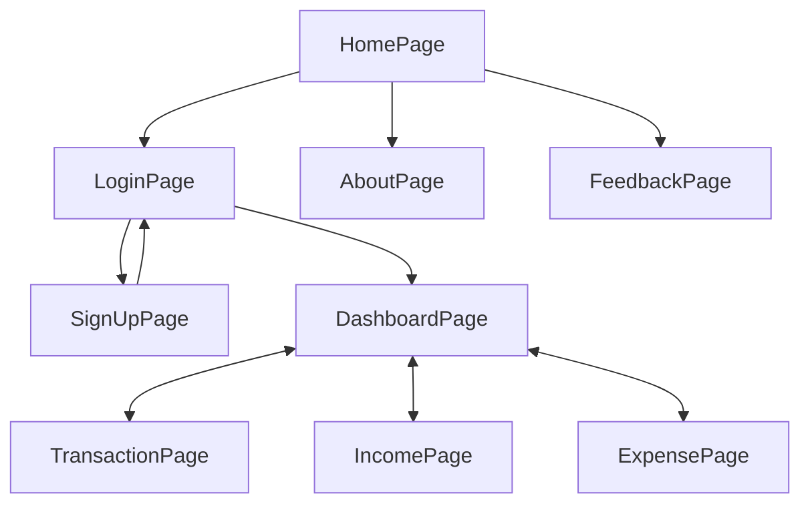

# Project Name 

 ## Finance-Manager

  

---

> ✨ABOUT 

⭕Finance-Manager,is an online platform that allows users to manage their finances effectively.

⭕The project typically includes designing and implementing features that enables users to track their incomes, expenses and prominent financial health.

⭕This web application will empower individual to gain better control over their financial situations, make informed decisions and achieve their financial goals 
  by better analysis, tracking and management of all transactions, incomes, expenses and savings.

---

 

💻 Project logo:- 

---

## 💫Tech-Stack->

- #### For Frontend :-
   - `HTML5`
  - `CSS3`
  - `JavaScript `

- #### For Database: -
   - `Local Storage `
  

   

---

## Features ✨:-
---
 | Serial No            | Feature                                                              |
| ----------------- | ------------------------------------------------------------------ |
| 1 | User signup and Login |
| 2 | Landing Page , About page, Feed Back Page|
| 3 | Dashboard Page |
| 4 | View All Transaction Page ,Impressive UI|
| 5 | Navbar, Sidebar ,completely Responsive  |

## Flow

---
## Screenshots 📷
---

# Home Page

# Signup Page 

# LoginPage

# Dashboard Page

# Transaction Page

# Income Page

# Expense Page

---

<h1 align="center">✨Thank You✨</h1>
